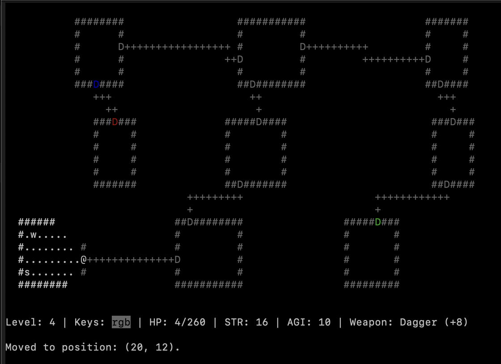
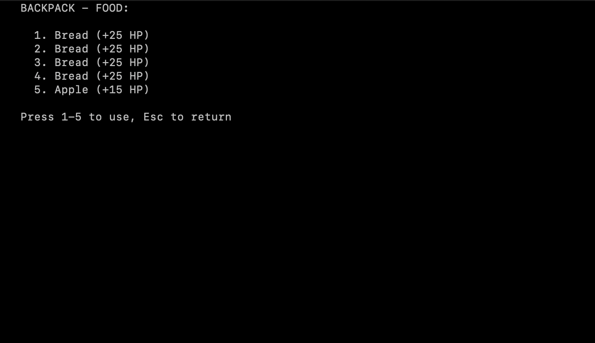

# Rogue

**Rogue** — консольная игра в жанре roguelike, реализованная на Swift 5.10 с использованием библиотеки `curses` для управления из терминала. Игра воспроизводит классическую механику Rogue 1980 года с современным подходом к архитектуре.

---

## Об игре

Пошаговое исследование случайно сгенерированных подземелий, состоящих из комнат и коридоров. Управляйте персонажем, сражайтесь с противниками, собирайте предметы и попробуйте пройти все 21 уровней.

---

## Особенности

- **Многослойная архитектура:**
  - **Presentation:** управление отображением и пользовательским вводом через curses.
  - **Domain:** игровая логика, сущности, правила игры.
  - **DataLayer:** сохранение и загрузка прогресса в JSON.
  - **Controller:** связывает все слои, обрабатывает ввод пользователя и управляет игровым
- **Геймплей:**
  - 21 уровень с 9 случайно сгенерированными комнатами и коридорами.
  - Пошаговые бои с 5 типами противников, каждый со своим поведением.
  - Управление персонажем с помощью клавиш WASD и использование предметов.
  - Полная поддержка инвентаря: оружие, еда, свитки, эликсиры.
  - Система прокачки характеристик и динамическое изменение сложности.
  - Таблица рекордов с сохранением результатов и статистики.
- **Генерация мира:**
  - Связный граф комнат и коридоров.
  - Стартовая и конечная комнаты для каждого уровня.
  - Уровни усложняются с прогрессом.
- **Рендеринг и интерфейс:**
  - Отображение стен, пола, коридоров и игровых объектов.
  - Реализация “тумана войны” с алгоритмом ray casting.
  - Интерактивные меню для выбора предметов в рюкзаке.
- **Дополнительно:**
  - Двери и разноцветные ключи.
  - Противник Мимик, имитирующий предметы.
  - Система адаптивного баланса сложности.

---

## Требования

- **Swift 5.10**
- **Терминал с поддержкой curses**
- **macOS**

---

## Управление

| Действие                | Клавиша |
|-------------------------|---------|
| Вверх                   | W       |
| Влево                   | A       |
| Вниз                    | S       |
| Вправо                  | D       |
| Использовать оружие     | h       |
| Использовать еду        | j       |
| Использовать эликсир    | k       |
| Использовать свиток     | e       |

> При использовании предмета выводится список для выбора (1–9), оружие — 0–9 (включая возможность убрать оружие из рук).

---

## Архитектура и компоненты

### Domain

- Игровая сессия, уровни, комнаты, коридоры.
- Персонажи: игрок и противники с характеристиками (здоровье, сила, ловкость и др.).
- Логика боя, перемещения, взаимодействия с предметами.
- Генерация уровней и поддержка разных типов противников.

### Presentation

- Консольный UI на основе curses.
- Рендеринг игрового мира и интерфейса.
- Обработка пользовательского ввода.

### DataLayer

- Сохранение/загрузка игрового прогресса в JSON.
- Восстановление состояния игры и статистики.

### Controller

- Управляет связью между Presentation и Domain слоями.
- Обрабатывает пользовательский ввод, передаёт команды в игровую логику.
- Синхронизирует состояние игры и отображение интерфейса.

---

## Как запустить

1. Склонируйте репозиторий
2. Перейдите в каталог проекта:
   ```sh
   cd Rogue
   ```
3. Соберите проект с помощью Swift Package Manager:
   ```sh
   swift build
   ```
4. Запустите игру:
   ```sh
   swift run
   ```
## Скриншоты

### Игровой процесс


### Инвентарь и выбор предметов


### Таблица рекордов


Больше скриншотов в папке screens/

